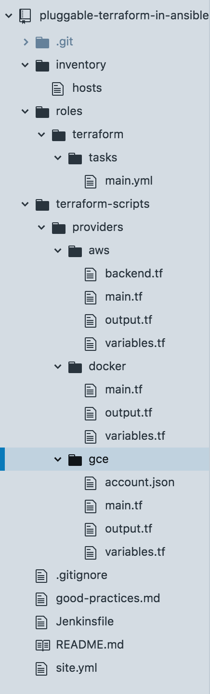
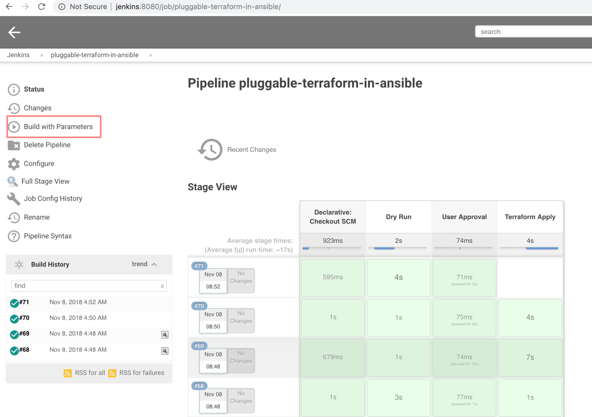
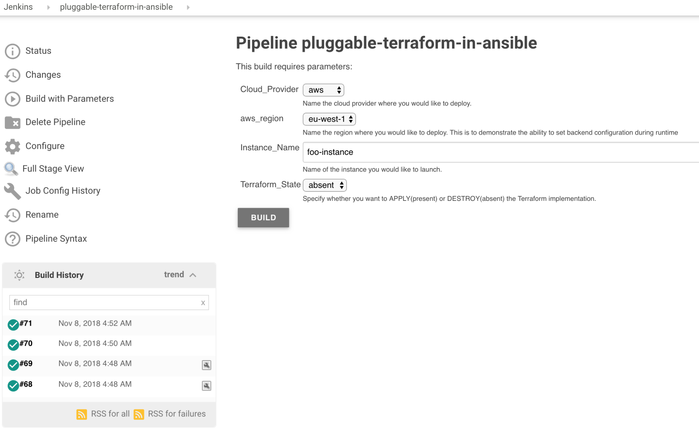
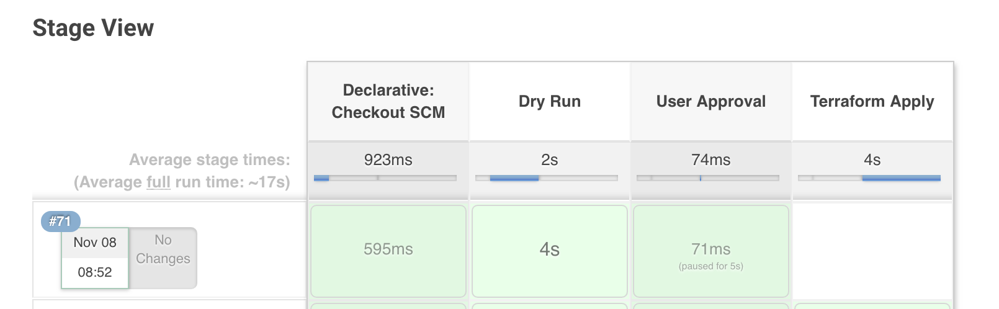
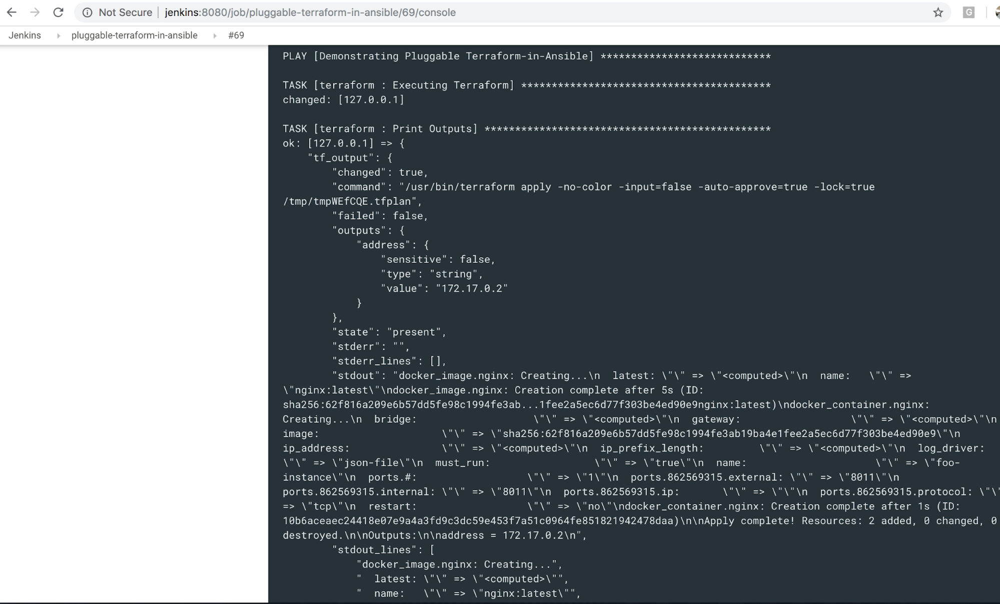
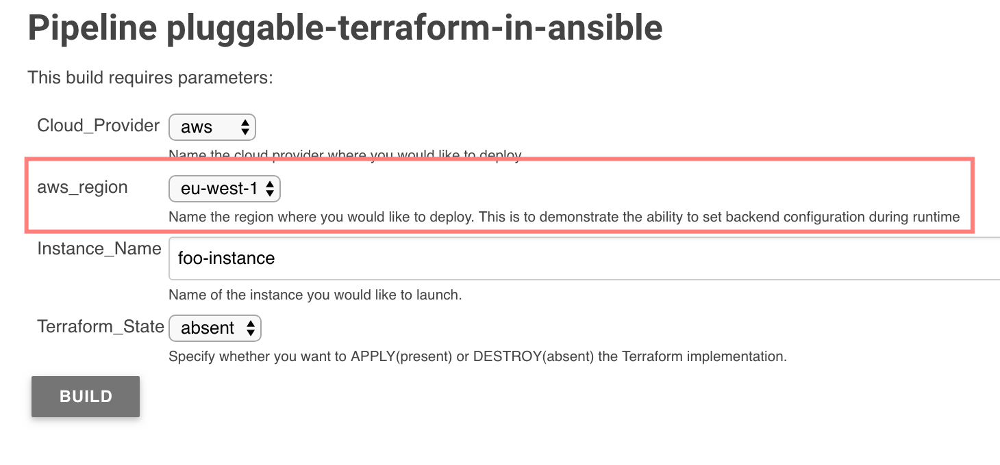
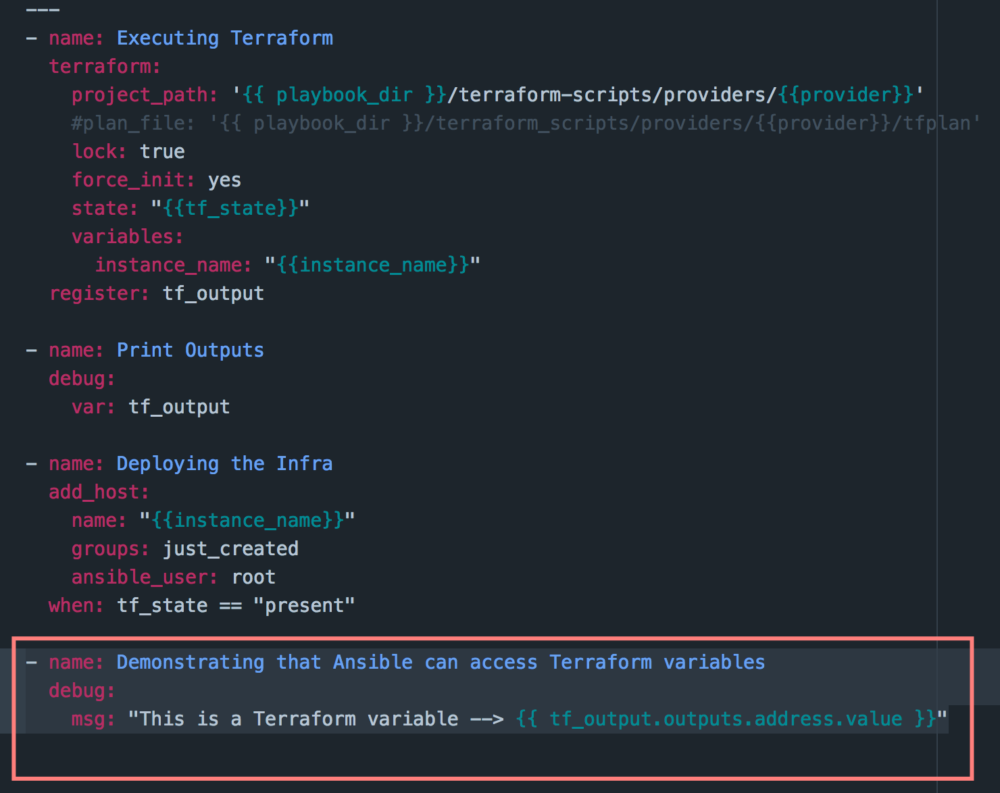
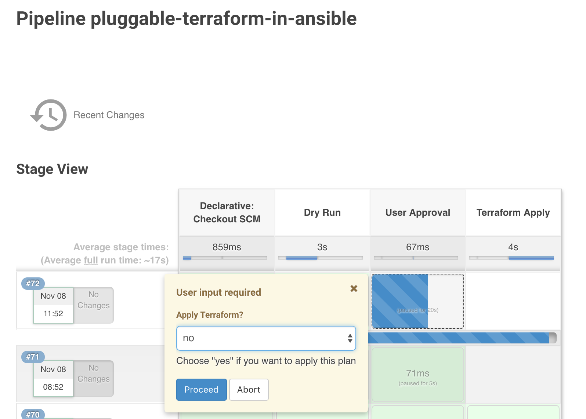
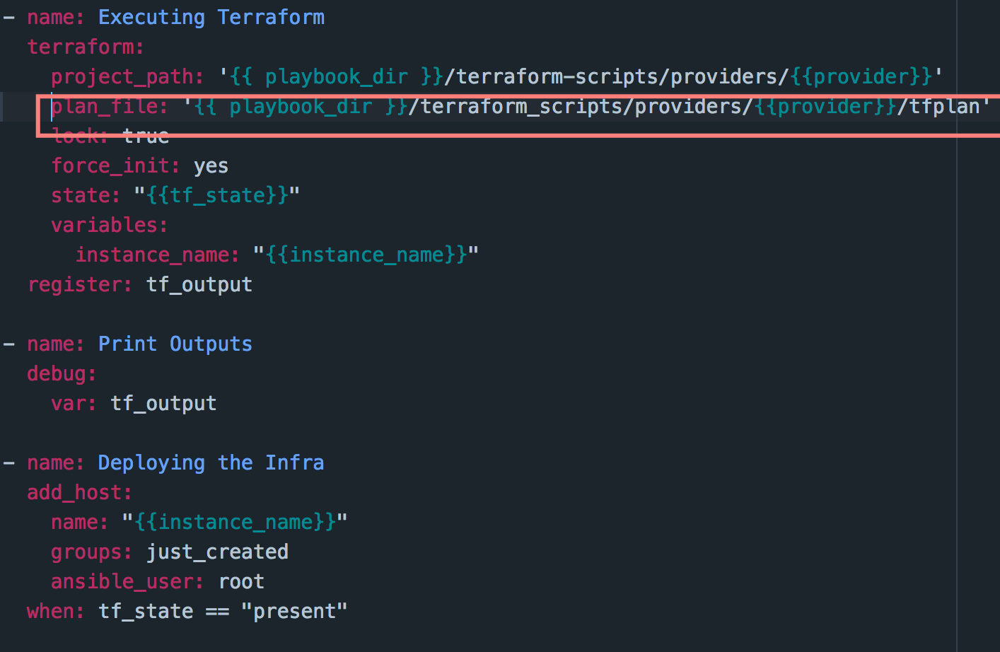

# pluggable-terraform-in-ansible

`Learning Resources for DevOps, SRE, Cloud & Engineering Management`

---

## Notes & Comments
* * *

### Goal

Ansible ( 2.5+) has recently released [a module for terraform](https://www.google.com/url?q=https://docs.ansible.com/ansible/2.6/modules/terraform_module.html&sa=D&ust=1541669704867000). This project aims to create an Ansible playbook to deploy terraform projects including deciding appropriate parameters to provide a good balance between usability and customizability. Further, this playbook is intended to be run within a Jenkins pipeline.

### Deliverables

The idea of this project is to have a Jenkins pipeline that invokes an Ansible Playbook which makes use of Ansible's \`Terraform\` module to execute Terraform Plans. The aim is to have various capabilities like:

\- Ability to set backend configuration during runtime

\- Ability to pass terraform variables through Ansible vars

\- Have a way to create, Only terraform plan and not execute it (for example, this can be used to create a manual approval stage)

\- Create the plan and execute it

\- Just execute a plan that has been created earlier

\- Comments on if you think the new module lacks these capabilities. Please mention them in detail. (Based on the outcome of this experiment)

### Solution

The solution comprises of a Jenkins pipeline that invokes an Ansible Playbook which makes use of Ansible's \`Terraform\` module to execute Terraform Plans.

Let's discuss some of the important files in the script base. The tree structure looks like this:

./Jenkinsfile- This contains the pipeline script in declarative style. Choice parameters are setup in this file to grab user inputs and pass this on to the ansible playbook.

./site.yml- This is the orchestrator for the playbook and basically calls the \`terraform\` ansible role.

./roles/terraform/tasks/main.yml- This file invokes the \`terraform\` module in ansible and applies the ./terraform\_scripts.

./terraform\_scripts - This is the directory that contains terraform scripts for various providers.

### Operation

1.  Jenkins pipeline is configured and cloud credentials are added to environment vars in jenkins for better security. Once everything is in place we execute the Jenkins \`build with parameters\` option.

2.  The pipeline has certain choice parameters that need to be selected by the user before triggering the \`build\`.

3.  Once build is triggered the pipeline goes through various stages-

Checkout: Checks out scripts from the SCM

Dry Run: Runs the ansible playbook without actually executing the scripts, allows to check syntax errors if any.

User Approval: User is asked to approve the \`terraform apply\`. Once she does it moves forward to apply the deployment and infra is created or destroyed based on that.

4.  Upon completion of the steps: Output from terraform is grabbed and stored as an output variable which is then accessed by ansible and printed in the logs:

### Comments on the Outcome

The aim of this project was to have various capabilities like:

\- Ability to set backend configuration during runtime

It is configured in the Jenkins pipeline to get input parameters and pass them on to the ansible script to configure the backends. For example, we are getting the \`region\` param from user and passing it to backend config in runtime.

\- Ability to pass terraform variables through Ansible vars

This has been done at multiple places in the script, for example in the outputs section we have a variable called addresses. Which can be accessed by ansible and printed.

\- Have a way to create, Only terraform plan and not execute it (for example, this can be used to create a manual approval stage)

For this an user approval stage has been added in the pipeline to prompt whether to apply the terraform or not.

\- Create the plan and execute it

This feature has been configured by using the ansible \`terraform\` module. Running the ansible in \`--check\` mode would do a dry run. However, this module lacks the capability to directly have a terraform plan executed. It's just \`present\` or \`absent\`. The \`planned\` choice in \`state\` is discussed in the next point.

\- Just execute a plan that has been created earlier

This is possible by supplying a predefined \`tfplan\` file in the plan\_file directive of the ansible terraform module. Further, the state has to be selected as \`planned\` when using this.

\- Comments on if you think the new module lacks these capabilities. Please mention them in detail.

The terraform module works fine in most areas but lacks certain capabilities, for example, it is not straightforward to generate a terraform plan using this module. One has to use the terraform command line binary to do that via ansible shell module. Also, when using the --check option for running the playbook and there is an ansible variable that is sourced from a terraform output, then it causes the script to fail with \`fatal error.: 'dict object' has no attribute\`

This issue can however be worked around, but that since we are discussing what the module lacks, so this is it.

* * *

<pre>
<a href="https://www.binpipe.org">BINPIPE</a> aims to simplify learning for those who are looking to make a foothold in the industry. 
Write to me at <b>nixgurus@gmail.com</b> if you are looking for tailor-made training sessions. 
For self-study resources look around in this repository, <a href="https://www.binpipe.org/">the Binpipe Blog</a> and <a href="https://www.youtube.com/channel/UCPTgt4Wo0MAnuzNEEZlk90A">Youtube Channel</a>.
</pre>

___
:ledger: Maintainer: **[Prasanjit Singh](https://www.linkedin.com/in/prasanjit-singh)** | **www.binpipe.org**
___

